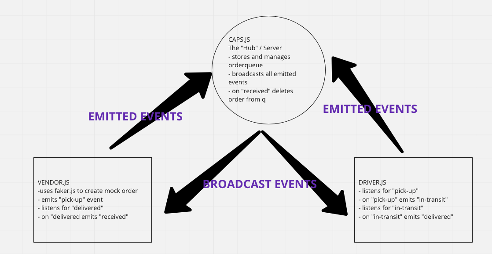

# Socket.io with Server Queue
Extension of previous event driven programming labs using socket.io to establish server and multiple clients.  `orderqueue` storage holds orders from placement of order thru delivery.  When the order is `received`, order is deleted from the `orderqueue`.

## Author: Taylor Thornton

## Set Up
- Clone this repo 
- Run npm init
- Install dependencies: 
    - faker
    - socket.io@2
    - socket.io-client@2
- Create local .env file to and declare local `PORT` and `STORE_NAME`

## UML

